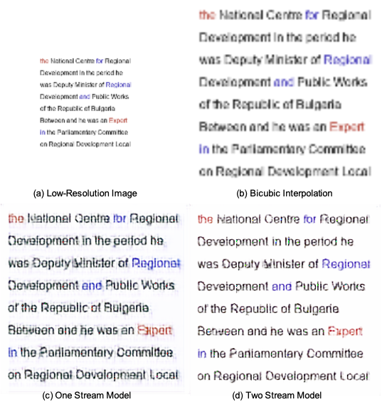

# Super-Resolution on Computer Texts

This repo examines the super-resolution effects on computer texts with different font sizes and font colors. The main contribution is as follows: 

- Data Collection Tool: A code to automatically make screenshots on Wikipedia.
- Text Image Generator
- Super-Resolution Model: An implementation of TSRN [1] Super Resolution Model and Experiment result on the self-collected dataset

## Sample Result

  

## Explore
1. We found that TSRN has the problem of generating the color of the texts properly, which increases the difficulty of recognizing the words.
2. We found that generating the gray scale along gives better text recognition rate compare to generating words with color
3. GP Loss has the problem of "Round Shape", how to penalize color consistency

## Progress
We can see improvements in MSE Loss and GP Loss after using 2 stream technique
1. color-structure 2 stream: Validation Gray MSE: 0.0106, Validation GP Loss: 0.0331, Validation MSEALL: 0.0099
2. tsrn: Validation MSE Loss:  0.0108 Validation GP Loss:  0.0335

## Possible Solution
- Sep 4
- Use an additional Conv Layer specifically for handling the color task
- Design a loss for the color
- Sep 16
- Set up two stream, one for gray scale prediction, another, for colorization
- Loss so that for the pixel given attention based on gray scale prediction, the color L2 length is long

## Reference
[1] Wang, W., Xie, E., Liu, X., Wang, W., Liang, D., Shen, C., & Bai, X. (2020). Scene text image super-resolution in the wild. In Computer Vision–ECCV 2020: 16th European Conference, Glasgow, UK, August 23–28, 2020, Proceedings, Part X 16 (pp. 650-666). Springer International Publishing.
